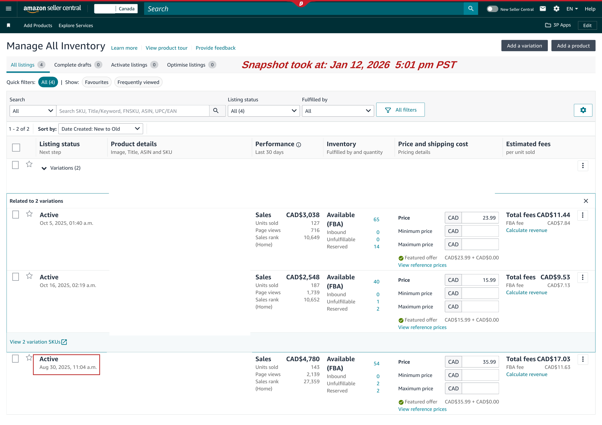
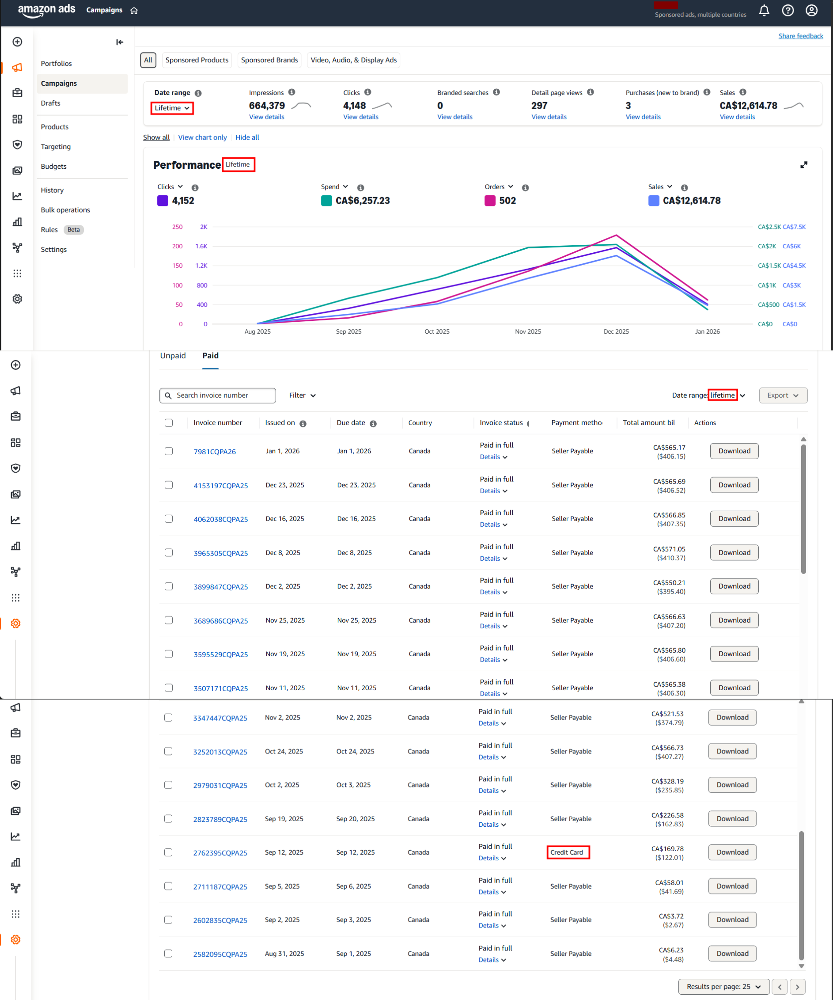

# Year-1 Operational Review

- **Reporting Period:** Jan 2025 – Dec 2025
- **Marketplace:** Amazon Canada
- **Currency**: Canadian Dollar (CAD)
- **Prepared by:** Muhammad Ibtisam Iqbal
- **Role:** Amazon Private Label Operator & Growth Lead

## Introduction

This is a **Year-1 operational review** of an Amazon Private Label business that I have been **building and managing continuously from inception**.

The report documents **how execution and capital were deployed during the first year**, and how those decisions translated into a live, revenue-generating operation that **continues beyond the reporting period**.

This review represents a **formal operational checkpoint**, not the conclusion of a project.

## Table of Contents

- Executive Summary
- Phase 1 — Private Label Build & Capital Deployment (Pre-Launch)
  - View A: Month-wise Capital Deployment & Operational Execution
  - View B: Product-attributable Capital & Launch Investment
- Post-Launch Capital Deployment (Year-1 Continuation)
- Phase 2 — Early Revenue Signals (Live Operations Checkpoint)
- Supporting Evidence — Operational Snapshots
- Closing Notes

## Executive Summary

This report reviews the **first operational year** of an Amazon Private Label business managed end-to-end under my direct execution.

During this period, the business progressed through two natural operating cycles:

* A **build and launch preparation cycle**, where capital was deployed in controlled stages to validate products, suppliers, and logistics.
* A **live marketplace cycle**, where products became active and began generating revenue under real operating conditions.

By the end of the reporting period, the account had **successfully transitioned into live selling**, generating measurable revenue and consistent unit movement during the final quarter of the year.

The business **remains active and under ongoing management**, with optimization and scaling continuing beyond this review.

## Phase 1 — Private Label Build & Capital Deployment (Pre-Launch)

Phase 1 documents the **complete build cycle** of the private label operation up to the point where inventory became live on Amazon.

This includes execution related to product validation, supplier sourcing, manufacturing, quality control, logistics, and listing readiness.

To maintain clarity, Phase 1 is presented through **two complementary analytical views** that describe the **same execution cycle from different allocation perspectives**.

## View A — Time-based Capital Deployment

### Scope

View A presents **when capital was deployed** and **which operational milestones triggered expenditure**.

Only actions resulting in **direct financial outflow** are reflected numerically.
Operational work without immediate cost is referenced only where it explains capital decisions.

The focus remains on **decision-driven spending**, not activity narration.

### Month-wise Capital Deployment & Activities

> The table below summarizes the final costs.
> Detailed calculations alongside the formulas are available in the linked spreadsheet.

[Please click here to view the same detailed cost calculations in Google Sheet](https://docs.google.com/spreadsheets/d/1-FAJ6k9zxYGIcAow7eP9xkoSLvW1NR7KEXe2RTeF7DU/edit?gid=0#gid=0)

| Month        | Activities Performed (Cost-Triggered Milestones)                                                                                                                                                                        | Expense Items Included                                                                                                                                 | Monthly Expenditure (CAD) | Cumulative Investment (CAD) |
| ------------ | ----------------------------------------------------------------------------------------------------------------------------------------------------------------------------------------------------------------------- | ------------------------------------------------------------------------------------------------------------------------------------------------------ | ------------------------- | --------------------------- |
| **Dec 2024** | Legal entity setup executed to establish the business structure required for operating an Amazon private label account.                                                                                                 | Company incorporation cost                                                                                                                             | 213.80                    | 213.80                      |
| **Jan 2025** | Digital identity established for the business to support brand ownership and external presence.                                                                                                                         | Company domain purchase                                                                                                                                | 21.00                     | 234.80                      |
| **Feb 2025** | Intellectual property risk validation and competitor benchmarking initiated to support product selection and its development. Brand identity groundwork executed.                                                       | Patent search + competitor product purchase (2 units) + logo design                                                                                    | 141.57                    | 376.37                      |
| **Mar 2025** | Supplier validation phase executed through controlled sample production. Samples from shortlisted suppliers shipped to home address (Canada) and benchmarked against competitor products prior to bulk commitment.               | Samples production and their shipment to Canada                                                                                            | 220.68                    | 597.05                      |
| **May 2025** | Manufacturing capacity secured via advance payments for both selected products. Additional sample shipment routed to Pakistan for product photography preparation. Brand trademark filing executed to secure ownership. | Manufacturing advance payment (both products) + sample shipment to Pakistan + trademark filing                 | **1,884.68**              | **2,481.73**                |
| **Jun 2025** | Product identifiers procured to meet Amazon catalog requirements. Manufacturing cycles completed and balance payments released. Third-party quality inspection executed prior to shipment authorization.                | UPC purchase + manufacturing balance payment (both products) + inspection fee (Product 1)                       | **4,044.71**              | **6,526.44**                |
| **Jul 2025** | Finished goods dispatched to Amazon fulfillment network. Listing conversion assets produced. Brand infrastructure finalized to support off-Amazon presence. Product-level inspection completed.                         | Freight (Product 1) + listing images & video (Product 1) + inspection fee (Product 2) + brand domain + SSL hosting + website development | **2,800.97**              | **9,327.41**                |
| **Aug 2025** | Pre-launch corrections and final enablement completed. SKU relabeling executed to resolve FNSKU discrepancies. Product-level media assets finalized. Remaining logistics charges settled.                               | SKU reprinting + listing images & video (Product 2) + freight (Product 2)                                                                | **1,263.57**              | **10,590.98**               |

## View B — Product-attributable Capital & Launch Investment

View B reorganizes pre-launch investment from a **product-centric perspective**.

To ensure analytical accuracy, costs are classified as follows:

* **Business-level setup costs** support the operation as a whole.
* **Shared operational costs** benefit multiple products.
* **Product-attributable costs** are directly linked to making a specific product launch-ready.

Only product-attributable costs are included in this view.

### Scope

While View A explains **when** capital was deployed, View B explains **how capital was absorbed at the product and SKU level**.

This enables clear visibility into per-product investment intensity, SKU structure, and inventory formation prior to sales.

### Product Capital Deployment

- Product 1 was launched as one SKU (Pack of 1)
- Product 2 inventory was split into two SKUs:
    - 600 units → Pack of 2 (300 packs)
    - 400 units → Pack of 1

| Product   | Units Ordered | SKU Structure                  | Manufacturing (Initial) | Manufacturing (Balance) | **Inspection** | **Freight**  | Images & Media | **Total** |
| --------- | ------------- | ------------------------------ | ----------------------- | ----------------------- | -------------- | ------------ | -------------- | ---------------------------- |
| Product 1 | 500           | Single SKU (Pack of 1)         | 1,087.30                | 2,492.79                | 171.39         | 1,766.13     | 618.00         | **6,135.61**                 |
| Product 2 | 1,000         | 2 SKUs (Pack of 1 & Pack of 2) | 280.00                  | 1,285.24                | 142.53         | 597.00       | 625.00         | **2,929.77**                 |
| **Total** | **1,500**     | **3 SKUs**                     | **1,367.30**            | **3,778.03**            | **313.92**     | **2,363.13** | **1,243.00**   | **9,065.38**                 |

### Capital Reconciliation — View A vs View B

The variance between View A and View B represents **essential one-time and shared setup costs** that enable the operation but cannot be cleanly allocated to individual products.

This distinction is intentional and ensures transparency rather than omission.

## Post-Launch Capital Deployment (Year-1 Continuation)

The Phase 1 table above reflects **pre-launch build capital only**, covering structured execution **up to August 2025**, when the first inventory batch went live.

Following launch, the business continued to deploy capital as part of **normal live operations**.

These expenditures are **intentionally excluded** from the Phase 1 table to avoid mixing build-stage costs with operating activity.

**Key post-launch deployments during Year-1:**

* **Inventory Restocking (Live Operations)**

  Based on sell-through velocity and forward coverage planning, both active products were restocked.

  Initial manufacturing deposits (30% for one SKU, 50% for the other) resulted in a combined restock deployment of: **1,978.47**

* **Launch-Stage Demand Activation**

  Controlled unit distribution was executed to establish early listing credibility and conversion readiness under live marketplace conditions.

  Total activation cost across both products: **2,036.66**

These represent **operational scaling investments**, not build-stage costs.

### Year-1 Capital Summary (Complete)

* **Pre-Launch Capital (Phase 1 Table):** 10,590.98
* **Post-Launch Operating Capital:** 4,015.13

**Total Capital Deployed During Year-1:** **14,606.11**

This figure represents the **full first-year capital commitment**, covering both structured build-out and live operational execution.

## Phase 2 — Early Revenue Signals (Live Operations Checkpoint)

Phase 2 documents the **initial revenue behavior** observed after products went live.

This section does **not** attempt profitability analysis or business valuation.
Its purpose is to:

* Record **when sales began**
* Observe **month-wise revenue progression**
* Capture **SKU-level behavior under live conditions**

The business remains operational.
This phase represents a **checkpoint within an ongoing execution cycle**, not a terminal stage.

### Scope & Methodology

* No automated profitability software was used at this stage.
* All figures are **formula-driven and manually reconciled**.
* Minor variances are expected at this maturity level.

To maintain readability:

* Only **final outputs** are presented
* Full calculations and formulas are provided via the linked sheet

### Data Structure Logic

Phase 2 data is organized **SKU-first**, reflecting how the business is actually operated.

Inventory, advertising, and performance are managed at the SKU level.
Monthly and account-level totals are derived through aggregation.

### SKU-Level Revenue Snapshot

| SKU             | Month    | Sales         | Units Sold | Net Result  |
| --------------- | -------- | ------------- | ---------- | ----------- |
| **SKU 1**       | Sep 2025 | 1,079.77      | 23         | -295.34     |
|                 | Oct 2025 | 2,073.73      | 62         | -508.43     |
|                 | Nov 2025 | 4,163.82      | 136        | -1,055.13   |
|                 | Dec 2025 | 6,022.21      | 178        | +12.70      |
| **SKU 2**       | Oct 2025 | 475.65        | 35         | -105.53     |
|                 | Nov 2025 | 1,325.38      | 101        | -254.54     |
|                 | Dec 2025 | 2,277.82      | 173        | -404.81     |
| **SKU 3**       | Oct 2025 | 119.95        | 5          | +18.22      |
|                 | Nov 2025 | 1,615.60      | 67         | +527.89     |
|                 | Dec 2025 | 2,609.95      | 108        | +839.71     |
| **TOTAL**       | Sep 2025 | 1,079.77      | 23         | -312.43     |
|                 | Oct 2025 | 2,669.33      | 102        | -595.74     |
|                 | Nov 2025 | 7,104.80      | 304        | -781.78     |
|                 | Dec 2025 | 10,909.98     | 459        | +447.61     |
| **GRAND TOTAL** |          | **21,457.56** | **888**    | **-1242.34** |

All numbers shown above are calculated using formulas in the following Google Sheet:

> **[View detailed calculations & formulas](https://docs.google.com/spreadsheets/d/1-FAJ6k9zxYGIcAow7eP9xkoSLvW1NR7KEXe2RTeF7DU/edit?gid=96928398#gid=96928398)**

This includes:

* Unit cost derivation from Phase 1 expenses
* SKU-level COGS logic
* Net result formulas
* Month-wise and total aggregation

## Supporting Evidence — Operational Snapshots

The following snapshots are included as **primary source references** extracted directly from Amazon Seller Central.

They are provided to validate figures presented in Phase 2, not to introduce interpretation.

### Snapshot 1 — Sales Dashboard

Validates first sale date, cumulative revenue, and unit sold.

### Snapshot 2 — Inventory Status (FBA)

Confirms live inventory movement and real sell-through.

### Snapshot 3 — Amazon Ads Invoices

Demonstrates that advertising spend transitioned primarily to **seller-payable (sales-funded)** settlement, indicating early cash-flow circulation.

### Snapshot 4 — Account Statements & Payouts

Confirms revenue realization through actual payouts, beyond dashboard metrics.

## Closing Notes

This report documents the **first operational cycle** of building and running an Amazon Private Label business — from structured capital deployment to early revenue validation.

Phase 1 focused on **controlled execution and risk-managed investment**.
Phase 2 captured **live marketplace behavior** without over-interpreting short-term financial outcomes.

The business **continues under active management**, with future reporting cycles expected to shift toward efficiency, scalability, and profitability analysis as operational maturity increases.

This document serves as:

* A transparent record for the client
* A verifiable operational case study
* A professional reference demonstrating end-to-end private label execution
